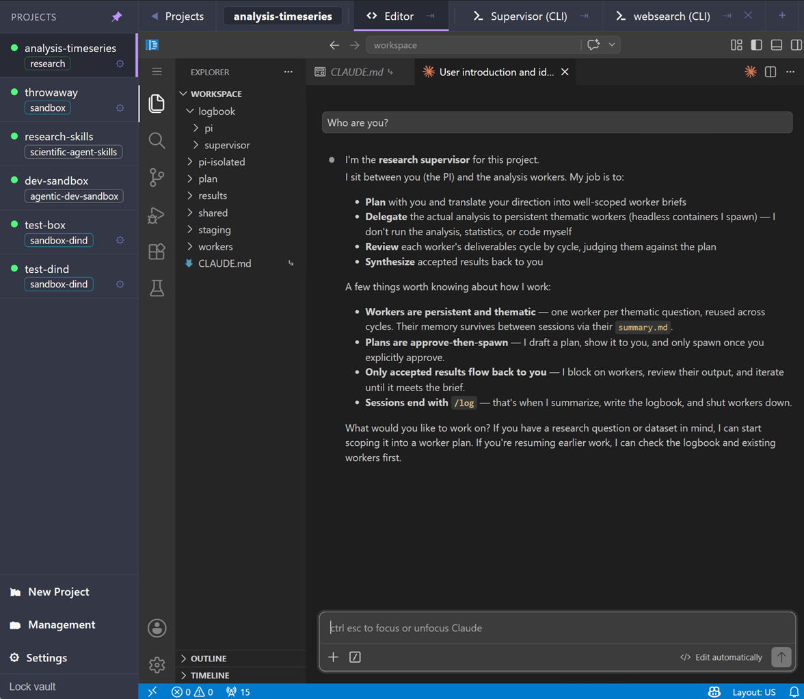

<div align="center">

# Research Sandbox

[](https://www.python.org/)
[](https://www.docker.com/)
[](https://github.com/anthropics/claude-code)
[](https://github.com/nestybox/sysbox)

An agentic sandbox for research and data analysis, modeled as a research lab: you are the research lead and drive a per-project supervisor that spawns sandboxed workers and their tools (MCP), supervises the tasks, keeps logbooks, and writes executive summaries for you. Drive the whole thing from a **browser UI** — a workflow store, project lifecycle, and in-browser terminals + editor — or from the host CLI. Built to work with flat-rate agentic AI subscriptions like Claude Code.

<br/>



</div>

---

### TL;DR

```bash
# 1. One-time setup — builds images, starts the router, caches the agent + editor dists
python research.py start

# 2. (optional but recommended) bring up the browser UI
python research.py broker passwd     # set the operator/management password (once)
python research.py broker start       # the host daemon that owns docker access
python research.py webui start         # HTTPS SPA on https://localhost:7777

# 3. Open https://localhost:7777 → pick a workflow card → name it → Create.
#    Sign in to Claude once (a terminal tab → `claude` → OAuth), then chat.
```

Prefer the shell? The same lifecycle is a few `python research.py …` commands away — see [Quick Start](#-quick-start).

---

### Contents

[◾ What it does](#-what-it-does) · [◾ The browser UI](#-the-browser-ui) · [◾ Workflows & the store](#-workflows--the-store) · [◾ Prerequisites](#-prerequisites) · [◾ Install](#-install) · [◾ Quick Start](#-quick-start) · [◾ What you get on disk](#-what-you-get-on-disk) · [◾ Capabilities: MCPs, workers, boxes](#-capabilities-mcps-workers-boxes) · [◾ Security model](#-security-model) · [◾ CLI essentials](#-cli-essentials) · [◾ File structure](#-file-structure) · [◾ Roadmap](#-roadmap) · [◾ Further reading](#-further-reading)

---

## ◾ What it does


You talk to **one** Claude Code session — the *supervisor*. It lives in a per-project container that holds the conversation, the plans, and the project's memory. When a research question arrives, it doesn't answer end-to-end itself. Instead it:

1. **Drafts a plan** — what a worker should do, what inputs it needs, what deliverable it owes back, how the result gets verified. You approve before anything spawns.
2. **Spawns a worker** — a fresh container running headless Claude Code with your data mounted read-only. It writes a notebook, computes, produces figures, and reports back.
3. **Reviews the deliverable** against the plan, iterating with the worker or escalating to you, then asks you to **accept** — promoting it to `results/`.
4. **Logs the session** — a chronological record plus per-topic executive summaries you read next time.

Workers are persistent and themed (one per coherent question, many cycles over the project's life), and disposable between sessions: the container is thrown away, the files stay. **The conversation is replaceable — the filesystem is the memory.**

That's the **research** workflow. Leaner ones exist too — disposable docker-in-docker boxes, single confined containers, and curated GitHub-repo "store" boxes. See [Workflows & the store](#-workflows--the-store).

## ◾ The browser UI

`research webui start` serves a single-page app over HTTPS. With the **broker** running it's a full control plane; with it stopped it's a read-only terminal surface. It's the recommended way to drive everything short of authoring images.

- **Workflow store.** A grid of clickable workflow cards (Research / Base / Store). Click one → a prefilled create form → live progress as the project comes up. Per-card **Explain** docs deep-link the learning material (or the repo's README, for store cards).
- **Management panel.** Lists the host's live projects and drives the **whole** lifecycle — create / start / stop / update / destroy / attach — each long op streaming a progress checklist. `destroy` requires typing the name *and* re-entering the management password (step-up).
- **Per-project config (the ⚙ gear).** Show/hide terminal tabs, toggle the editor, and — on DIND projects — manage **boxes** (add/remove disposable sub-boxes with a preset + agent/editor/MCP toggles).
- **Terminals + editor.** In-browser ssh/byobu terminals per service (xterm + host-key TOFU + Ctrl-F search) and the code-server editor in an iframe, plus a split-pane to pin one service beside another.
- **Auth.** A client-side **vault password** encrypts your project bookmarks *in the browser* (never sent to the server). A separate **management password** (`broker passwd`) logs the Management panel into the broker; the broker token lives server-side behind an opaque cookie. Signing in to **Claude** is still per-project (interactive `/login` inside the supervisor).

> [!NOTE]
> This is the **single-operator** setup — one shared management password, proportionate for a localhost / private-tailnet box. The webui and broker run as **you** (same uid): that's the contract that lets the webui reach the broker's socket, and the webui holds **no docker socket** of its own. Multi-user accounts, recoverable soft-delete, and login rate-limiting are planned before exposing it beyond localhost.

## ◾ Workflows & the store

`project create` (or clicking a store card) selects a **workflow**. The workflow derives the container substrate and what gets stood up; bare `create <name>` defaults to `research`.

| Workflow | Substrate | What you get |
|---|---|---|
| **`research`** (default) | dind-sysbox | The full lab: a supervisor agent + headless analysis workers + service role-MCPs. |
| **`sandbox-dind`** | dind-sysbox | An agent box **with inner Docker**: spin isolated, disposable **boxes** via the webui or the in-box `rs-sandbox` CLI. |
| **`sandbox`** | docker (runc) | A **single confined container** — ssh + byobu + editor, no inner docker. Add an agent with `--agent claude`. |
| **store** workflows | docker / dind | Curated public GitHub repos, **cloned into a box at create with the editor + claude on** — a ready-to-explore environment. |

The shipped store workflows (`research workflow list`):

| Card | Clones | Box |
|---|---|---|
| `social-data-pipeline` | joaopn/social-data-pipeline | sandbox-dind (inner Docker, locked egress) |
| `agentic-dev-sandbox` | joaopn/agentic-dev-sandbox | sandbox-dind |
| `academic-research-skills` | Imbad0202/academic-research-skills | sandbox (runc, claude on) |
| `scientific-agent-skills` | k-dense-ai/scientific-agent-skills | sandbox |

```bash
python research.py project create lab --workflow research --data ~/data
python research.py project create dev --workflow agentic-dev-sandbox
python research.py workflow list                 # the full catalog
```

The sandbox flavors default to **`--egress locked`** (80/443/DNS/ICMP only, RFC1918 blocked) — containment first. `research` defaults to open egress (it needs pip/apt). Override either with `--egress`.

## ◾ Prerequisites

- [Docker](https://www.docker.com/) Engine with Compose v2 (`docker compose`)
- [Python](https://www.python.org/) 3.9+ (host CLI is stdlib-only — conda, pyenv, system Python, anything works)
- An [Anthropic Claude](https://www.anthropic.com/) subscription (Pro/Team or API access — you authenticate *inside* the project; there are no host-side API keys)

> [!TIP]
> Strongly recommended: [Sysbox](https://github.com/nestybox/sysbox#installation). It's the cleanest way to run a Docker daemon inside a container, giving user-namespace isolation without `--privileged`. Without it the CLI falls back to `--privileged` mode, which works but is less isolated. Linux only.

## ◾ Install

Three surfaces. The **host CLI** is the foundation; the **browser UI** and the **dists** layer on top.

**1. Shared infrastructure + images** (required, once):

```bash
python research.py start
```

Builds all container images, starts the small **`rs-router`** egress-filter container, and auto-caches the agent + editor dists if absent. Idempotent — re-run anytime; add `--rebuild` after editing image sources. The image tree is layered so a rebuild only cascades where it must (a no-DIND base → the sysbox-DIND base → flavor leaves). Pins live in `versions.env` (`research images versions`).

**2. Agent + editor dists** (auto on `start`):

Claude Code and the code-server editor are **not baked into images** — they're built once into a host cache and `cp`-deployed into every container at boot. `start` pulls them if missing; you only touch these to upgrade:

```bash
python research.py agent show | pull | refresh      # the Claude Code dist
python research.py editor show | pull | refresh       # the code-server editor dist
```

A DIND project requires a pulled agent dist; `start` guarantees it. Upgrades are deliberate: `refresh` bumps the `versions.env` pin, and existing projects pick it up via `project update-agent` or a recreate.

**3. Browser UI + broker** (optional, recommended): see [The browser UI](#-the-browser-ui) and the TL;DR. Off by default — with the broker stopped the CLI is unchanged and the webui is read-only.

## ◾ Quick Start

The research flow, end to end on the CLI (the browser UI does all of this without a shell):

```bash
python research.py start                                   # 1. shared infra
python research.py project create myproj --data /path/to/data   # 2. create
python research.py project attach myproj                    # 3. sign in to Claude
#   inside byobu:  claude  → complete OAuth → /exit → Ctrl-A D → exit
#   (or VSCode Remote-SSH to research@localhost:<ssh-port> and use the Claude Code extension)
```

Each `--data` path is mounted **read-only** at `/workspace/shared/data/<basename>/` (comma-separated for several). Credentials live **inside** the supervisor (never on the host), are copied into each worker at spawn, and are deleted on `destroy`.

**4. Run a thread.** Describe what you want in plain English — *"Is the response-time distribution in `/workspace/shared/data/<name>/` heavy-tailed, and what does a typical user look like?"* The supervisor proposes worker plans, you say "go", it spawns workers, reviews their staged outputs, and asks you to accept.

**5. End the session.** Type `/log`. The supervisor writes a session log + per-topic executive summaries and shuts workers down cleanly.

**6. Tear down.** `python research.py project destroy myproj` — removes the container, workspace dir, network, and credentials snapshot.

## ◾ What you get on disk

Everything lives under `container_volumes/<proj>/workspace/`. The bits you'll actually open:

- **`results/<worker>/<NNN>_<slug>/`** — every accepted cycle, numbered. Notebook(s), data, figures, + a snapshot of the plan that produced it.
- **`logbook/pi/<date>-<slug>.md`** — executive summaries for you, one per topic per session, with `**Source:**` links down to the supervisor's log.
- **`logbook/supervisor/<date>-<HHMM>.md`** — the supervisor's chronological notes (drill-down).
- **`workers/<worker>/work/`** — each worker's full sandbox: notebooks (clean + scratch), `research_log.md`, every cycle.
- **`plan/<worker>.md`** — the canonical plan bound to each worker; **`staging/<worker>`** — present only when a cycle awaits your accept.

Logs are append-only; the supervisor never edits worker outputs by hand; plans go through an approve gate.

## ◾ Capabilities: MCPs, workers, boxes

Two host-level registries plus the disposable-box surface. The mental model: **`mcp` = tools, `worker` = pipeline agents, boxes = your interactive containers.**

### MCP servers — `mcp`

If a worker needs more than your local data — search arxiv, query a DB, hit a private tool — register an [MCP server](https://modelcontextprotocol.io/) and grant projects access:

```bash
python research.py mcp add arxiv --kind shared --image ghcr.io/blazickjp/arxiv-mcp-server:latest --port 8000
python research.py mcp enable arxiv
python research.py project mcp allow myproj arxiv
```

`mcp add` writes the registry; `mcp enable` flips the per-MCP flag (and auto-allows it into new projects); `project mcp allow` refuses a disabled MCP; `research start` auto-launches every enabled *shared* MCP. Every MCP is reached through the per-project **mcp-proxy** at a single internal address — workers can't reach an MCP they weren't granted. The server must speak streamable-HTTP and follow a small contract; see [docs/GUIDE.md](docs/GUIDE.md).

### Worker services — `worker`

Pipeline-side agents the supervisor's analysis workers call through the proxy (`research worker list`):

| Service | Purpose |
|---|---|
| **`websearcher`** | image-baked browser (Playwright + Chromium) for web research. **Default-on** in new projects. |
| **`wrangler`** | data-wrangling helper; inert until you allow DB MCPs for the project. |
| **`echo-mcp`** | a no-op fixture used for substrate testing. |

(Plus the **analysis** worker itself — spawned per question by the supervisor via `rs-worker`, not pre-registered.) A host-level *enabled* flag auto-applies a service to every new project at `create`; only `websearcher` is default-on. `--disable websearcher` overrules per project.

### Boxes (DIND projects)

On any DIND project (`research` / `sandbox-dind`) you can spin **boxes** — isolated, disposable sub-containers — from the webui's ⚙ → Boxes, or the in-box `rs-sandbox` CLI. Each box is a **preset** over two images:

| Preset | What it is |
|---|---|
| **`empty`** | a blank box (base image) |
| **`websearcher`** | the base + a baked browser (Playwright + Chromium) |
| **`data-wrangler`** | the base, oriented for data work |
| **`byo`** | bring your own — clone a repo / run a setup snippet at boot |

Per-box toggles: `--agent claude` (or none), `--editor`, `--mcps <subset of the project allowlist>`, and `--repo/--ref/--setup` for the `byo` preset. Boxes boot un-authed and reach an LLM / pip / apt through the project's locked egress — the containment is router + no-creds + container isolation.

## ◾ Security model

The **container is the security boundary**; agents run under `bypassPermissions` inside it. Layers (full detail in [docs/SECURITY.md](docs/SECURITY.md)):

- **No host coupling.** No host credential bind-mounts, no docker socket pass-through to agents. Claude auth lives inside each project and is deleted on destroy.
- **DIND isolation.** DIND supervisors run under **sysbox-runc** (user-namespace isolation, no `--privileged`); their inner Docker daemon runs workers as ordinary containers. The bare `sandbox` workflow is a single runc container.
- **Per-project network + egress filter.** Each project gets its own bridge, route-injected through `rs-router`, whose iptables FORWARD rules key on the project subnet. **Open** mode allows outbound except RFC1918; **locked** mode allows only 80/443/DNS/ICMP. RFC1918 is dropped unconditionally. Sandbox flavors default to locked.
- **MCP gating.** Workers reach MCPs only through the per-project **mcp-proxy**, and only those in the project's allowlist. An optional **inner-bridge firewall** (`--inner-firewall`) further confines worker→proxy traffic.
- **Broker = the host-root boundary.** The opt-in broker is the *only* component with docker access. It serves a **closed verb vocabulary** over a 0600 unix socket (length-prefixed JSON, `SO_PEERCRED` same-uid check — no network listener). Every verb dispatches to a fixed lifecycle function over a validated request; **no docker passthrough**. Reads (`list`/`status`) are open at the socket; every write verb is **token-gated** (deny-by-default), `destroy` and box-remove additionally require **step-up re-auth**. Rich-input verbs forward only an explicit **field allow-list** — a relayed request can never reach a host path, a bind-mount source, or a host port. The network-facing webui holds no docker socket and relays everything through the broker behind its session.

## ◾ CLI essentials

Everyday commands. Every subcommand has `--help`; the full reference lives in [docs/GUIDE.md](docs/GUIDE.md).

```bash
# infrastructure
python research.py start [--rebuild]                # build images + router + cache dists
python research.py stop                             # stop the router (projects untouched)

# project lifecycle
python research.py project create <name> [--workflow W] [--data PATHS] [--egress open|locked] [opts]
python research.py project attach | ssh | status | list <name>
python research.py project stop | start | destroy <name|--all>
python research.py project update <name> [--rebuild] [--enable IDS] [--disable IDS]

# dists, browser UI, workflows
python research.py agent  show | pull | refresh
python research.py editor show | pull | refresh
python research.py broker passwd | start | stop | status
python research.py webui  start [--bind IP] [--port N] | stop | status | cert-tailscale
python research.py workflow list

# capabilities
python research.py mcp    add | enable | disable | list | start | stop | test ...
python research.py project mcp allow | deny | list | sync <proj> [<mcp>]
python research.py worker list | enable | disable ...
python research.py project worker enable | disable | stop | start | list | status <proj> [<name>]
```

**In-supervisor CLIs** (the supervisor's Claude uses these; you rarely call them directly): **`rs-worker`** — analysis-worker lifecycle (`spawn --plan`, `list`, `wait`, `finalize`/`accept`/`unstage`, `attach`/`tail`); **`rs-sandbox`** — box lifecycle on DIND projects (`create [name] --preset empty|websearcher|data-wrangler|byo [--agent claude] [--editor]`, `list`, `discard`).

## ◾ File structure

```
research-sandbox/
├── research.py                   Host CLI (Python stdlib only)
├── docker-compose.yml            Router + webui services
├── versions.env                  Image / dist version pins
├── .env / .env.example           Host config (PROJECTS_DIR, SANDBOX_DNS, defaults)
├── workflows/*.json              Workflow manifests (research, sandbox-dind, sandbox, store)
├── boxes/*.json                  Box presets (empty, websearcher, data-wrangler, byo)
├── cli/                          rscore (lifecycle) + in-container CLIs + registries
├── agent/                        Container Dockerfiles + entrypoints (layered bases + leaves)
├── container/                    Templates baked into images (supervisor / analysis / …)
├── router/                       Egress-filter router (Alpine + iptables)
├── webui/                        Browser SPA + aiohttp server + per-service tab defs
├── docs/{GUIDE,SECURITY}.md      Workflow/MCP authoring + threat model
└── external/                     Vendored reference code (not a dependency)
```

Per-project workspace at `container_volumes/<proj>/workspace/`: `results/`, `logbook/{pi,supervisor}/`, `workers/<name>/work/`, `plan/`, `staging/`, `shared/data/<basename>/`, and `.orchestrator/{role-mcps,mcp-allow}.json` (the per-project registries).

## ◾ Roadmap

- **Store & boxes** — a richer workflow store (more curated repos, per-repo setup scripts) and **app-type** boxes (ready-built stacks like Overleaf / Quartz / Slidev in a browser tab).
- **Control plane** — recoverable soft-delete + rate-limiting before exposing the webui beyond localhost; multi-host **federation** (one frontend → many single-host instances).
- **Pluggable worker runtime** — surface the worker LLM endpoint choice (API / OpenAI-compatible) to operators.

## ◾ Further reading

- **[docs/GUIDE.md](docs/GUIDE.md)** — how a research thread plays out, the supervisor↔worker protocol, the full CLI reference, authoring an MCP server, debugging, FAQ.
- **[docs/SECURITY.md](docs/SECURITY.md)** — threat model, isolation layers, what's prevented and what isn't.

<div align="center">
<sub>Licensed under the file <a href="LICENSE">LICENSE</a>.</sub>
</div>
