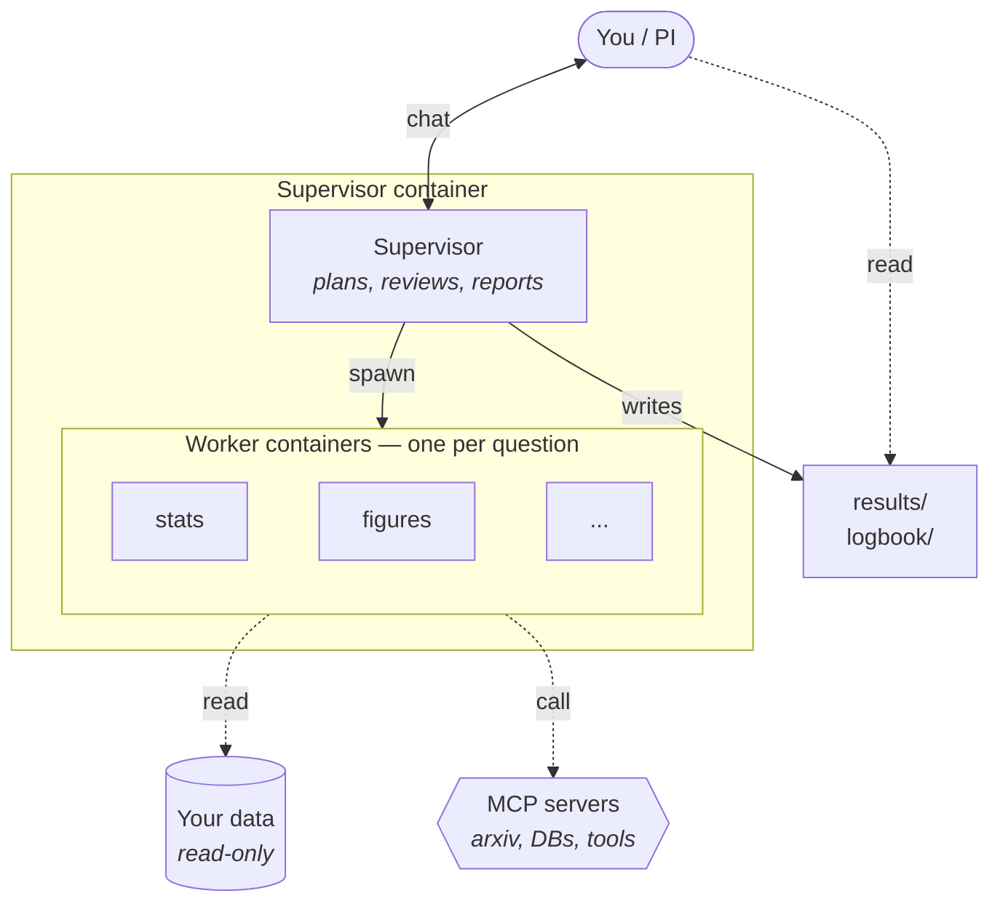

<div align="center">

# Research Sandbox

[](https://www.python.org/)
[](https://www.docker.com/)
[](https://github.com/anthropics/claude-code)
[](https://github.com/nestybox/sysbox)

An agentic sandbox for research and data analysis, modeled as a research lab: you are the research lead and interact with a per-project supervisor. It spawns sandboxed workers and their tools (MCP), supervises the tasks, keeps logbooks, and writes executive summaries for you. Workers are long-lived but disposable. Built to work with flat-rate agentic AI subscriptions like Claude Code.

</div>

### TL;DR

```bash
# 1. One-time setup — builds images, starts the router, caches the agent + editor dists
python research.py start

# 2. Create a research project pointing at your dataset
python research.py project create myproj --data /path/to/dataset

# 3. Sign in to Claude inside the supervisor (once per project)
python research.py project attach myproj
# in the terminal: `claude` → device-code OAuth → /exit → Ctrl-A D → exit
# OR: VSCode Remote-SSH and click the Claude Code extension

# 4. Talk to Claude. Ask research questions. It plans, runs workers, reports back.

# 5. Read results on the host
ls container_volumes/myproj/workspace/results/
ls container_volumes/myproj/workspace/logbook/pi/

# 6. Tear down when done
python research.py project destroy myproj
```

---

### Table of Contents

[◾ What it does](#-what-it-does)
[◾ Why use this](#-why-use-this)
[◾ Prerequisites](#-prerequisites)
[◾ Fresh install — every surface](#-fresh-install--every-surface)
[◾ Workflows](#-workflows)
[◾ Quick Start (research flow)](#-quick-start-research-flow)
[◾ What you get on disk](#-what-you-get-on-disk)
[◾ MCP servers](#-mcp-servers)
[◾ Capabilities: workflows, extensions & nodes](#-capabilities-workflows-extensions--nodes)
[◾ Browser UI](#-browser-ui)
[◾ Security model](#-security-model)
[◾ CLI Reference](#-cli-reference)
[◾ File Structure](#-file-structure)
[◾ Roadmap](#-roadmap)
[◾ Further Reading](#-further-reading)

---

## ◾ What it does



You talk to **one** Claude Code session — the *supervisor*. The supervisor lives in a per-project container that holds the conversation, the plans, and the project's memory. When a research question arrives, it doesn't try to answer end-to-end itself. Instead it:

1. **Drafts a plan** describing what the worker should do, what inputs it needs, what deliverable it owes back, and how the supervisor will verify the result. You see the plan and approve it before anything spawns.
2. **Spawns a worker** — a fresh container running headless Claude Code with your data mounted read-only. The worker writes a notebook, computes things, produces figures, and reports back.
3. **Reviews the deliverable** against the plan. If it looks right, the supervisor finalizes the cycle and asks you to accept. If something's off, it iterates with the worker (or escalates to you).
4. **Logs the session** — at the end, it writes one chronological record of what happened and N executive summaries (one per topic) for you to read next time.

Workers are persistent and themed: one worker per coherent question, multiple cycles over the project's life. Between sessions they go cold (container disposed, files preserved); next session picks up from their `summary.md`. The conversation is replaceable — the filesystem is the memory.

That is the **research** workflow. There are two leaner ones too — an agent-less docker-in-docker **sandbox host** that spins disposable boxes, and a single confined **sandbox** container — see [Workflows](#-workflows).

## ◾ Why use this

Compared to opening multiple Claude Code windows by hand:

- **No "where were we?" at the start of each session.** The supervisor reads its own logbook; workers read their own summaries. Cold-resume is automatic.
- **No context-window bloat.** Each worker only knows about its own question. The supervisor stays focused on orchestration.
- **Parallel work without coordination overhead.** The supervisor spawns multiple workers for one decomposed question; you don't manage them.
- **A clean record afterwards.** `results/<worker>/<NNN>_<slug>/` contains accepted notebooks + data + a snapshot of the plan that produced them. Nothing rejected sneaks in.
- **The PI is the editor, not the runner.** The harness keeps the supervisor honest — you approve plans before spawn, you accept deliverables before they're promoted.

Compared to a fully autonomous agent: **you're in the loop on every plan and every accept.** Workers can't be spawned without your "go", deliverables can't be marked accepted without your "approve". The harness enforces this.

## ◾ Prerequisites

- [Docker](https://www.docker.com/) Engine with Compose v2 (`docker compose`)
- [Python](https://www.python.org/) 3.9+ (host CLI is stdlib-only — conda, pyenv, system Python, anything works)
- An [Anthropic Claude](https://www.anthropic.com/) subscription (Pro/Team or API access — you authenticate *inside* the project; there are no host-side API keys to set up)

> [!TIP]
> Strongly recommended: [Sysbox](https://github.com/nestybox/sysbox#installation). It's the cleanest way to run a Docker daemon inside a container, giving user-namespace isolation without `--privileged`. Without it the CLI falls back to `--privileged` mode, which works but is less isolated. Linux only.

---

## ◾ Fresh install — every surface

There are three surfaces. The **host CLI** is the foundation; the **browser UI** and the **dists** layer on top. A fresh box, from nothing:

### 1. Shared infrastructure + image build (required, once)

```bash
python research.py start
```

On first run this **builds all container images**, starts the small **`rs-router`** egress-filter container, and **auto-caches the agent + editor dists** (see below) if they're absent. Idempotent — re-run anytime. Add `--rebuild` after editing any image source under `agent/`, `cli/`, `container/`, or `webui/`.

The image tree is layered so a rebuild only cascades where it must: a no-DIND `rs-minimal-base` → the sysbox-DIND `rs-substrate-base` → the flavor leaves (`rs-supervisor` for research, `rs-sandbox-dind` for the box host), plus the worker/role-MCP/extension/proxy images. Version pins live in `versions.env`; `research images versions` prints them.

### 2. Agent + editor dists (auto on `start`; manage explicitly if you want)

Claude Code and the code-server editor are **not baked into images** — they're built once into a host cache and `cp`-deployed into every container at boot. `start` pulls them if missing; you only touch these to upgrade:

```bash
python research.py agent show                 # cached agent dists + pinned versions
python research.py agent pull                  # build/cache the pinned claude dist
python research.py agent refresh               # check upstream, offer to bump the pin + re-pull

python research.py editor show                  # cached code-server dist + version
python research.py editor pull                   # build/cache the pinned editor dist
python research.py editor refresh                 # check upstream, offer to bump + re-pull
```

A dind project (research / sandbox-dind) **requires** a pulled agent dist; `start` guarantees it. Upgrades are deliberate: `refresh` bumps the `versions.env` pin, and existing projects pick it up via `project update-agent` / a recreate.

### 3. Host CLI — create your first project

```bash
python research.py project create myproj --data /path/to/data
python research.py project attach myproj        # then `claude` → OAuth (once per project)
```

That's the whole CLI surface for everyday use. See [Quick Start](#-quick-start-research-flow).

### 4. Browser UI + broker (optional)

A single-page app over HTTPS that gives you in-browser terminals plus a Management panel that drives the **whole** project lifecycle — create / start / stop / update / destroy / attach, plus box and extension management — without a shell. Two cooperating pieces:

```bash
# one-time: set the operator (management) password
python research.py broker passwd

# the host daemon that owns docker access behind a closed verb vocabulary
python research.py broker start

# the browser-facing container (HTTPS on 127.0.0.1:7777 by default)
python research.py webui start
#   --bind 0.0.0.0 to expose on your LAN / Tailscale ; --port to change the port
```

Open **https://localhost:7777** and accept the self-signed cert (or `python research.py webui cert-tailscale` for a real cert over your tailnet). The webui and broker run as **you** (same uid) — that's the contract that lets the webui reach the broker's socket, and the webui holds **no docker socket** of its own. Off by default: with the broker stopped the webui is a read-only terminal surface and the CLI is unchanged. See [Browser UI](#-browser-ui).

---

## ◾ Workflows

`project create` selects a **workflow** with `--workflow` (bare `create <name>` defaults to `research`). The workflow derives the container substrate and what gets stood up:

| Workflow | Substrate | What you get | Agent? |
|---|---|---|---|
| **`research`** (default) | dind-sysbox | The full lab: a supervisor agent + headless analysis workers + service role-MCPs + PI extension tabs. | yes (claude) |
| **`sandbox-dind`** | dind-sysbox | An **agent-less** docker-in-docker host: a Management shell that spins isolated, disposable **boxes** via the in-box `rs-sandbox` CLI (or the webui Boxes section). | no (boxes opt in per-box) |
| **`sandbox`** | docker (runc) | A **single confined container** — ssh + byobu, no inner docker, no agent. A bare box. The editor is off by default (`--enable code-server` to add it); add an agent with `--agent claude`. | opt-in |

```bash
python research.py project create lab --workflow research --data ~/data
python research.py project create boxhost --workflow sandbox-dind
python research.py project create scratch --workflow sandbox --enable code-server
python research.py workflow list                 # the catalog (built-in + any BYO)
```

The two sandbox flavors default to **`--egress locked`** (80/443/DNS/ICMP only, RFC1918 blocked) — containment first. `research` defaults to open egress (it needs pip/apt). Override either with `--egress`.

---

## ◾ Quick Start (research flow)

#### 1. Bring up shared infrastructure

```bash
python research.py start
```

#### 2. Create a project

```bash
python research.py project create myproj --data /path/to/your/data
```

Creates a per-project workspace at `container_volumes/myproj/workspace/`, brings up the supervisor, and prints an SSH password. Each `--data` path is mounted **read-only** at `/workspace/shared/data/<basename>/`. `--data` is comma-separated for multiple paths. Useful flags: `--memory 16g`, `--cpus 4`, `--egress locked`, `--inner-firewall`, `--enable <ids>`. See `project create --help`.

#### 3. Sign in to Claude (once per project)

```bash
# (a) Quick: byobu device-code OAuth in the supervisor's terminal
python research.py project attach myproj
#   inside byobu:  claude  → complete OAuth in your browser → /exit → Ctrl-A D → exit

# (b) Everyday: VSCode Remote-SSH to research@localhost:<ssh-port> (password from `create`),
#     open /workspace, click the Claude Code extension to sign in.
```

Credentials are stored **inside** the supervisor (never on the host) and copied into each worker at spawn time. `project destroy` deletes them. There are no host-side API keys.

#### 4. Run a research thread

Describe what you want in plain English. *"Look at the dataset in `/workspace/shared/data/<name>/`. Is the response-time distribution heavy-tailed, and what does a typical user look like?"* The supervisor proposes worker plans, you say "go", it spawns workers, reviews their staged outputs, and asks you to accept — promoting deliverables to `results/`.

#### 5. End the session

Type `/log`. The supervisor writes a chronological session log + per-topic executive summaries and shuts workers down cleanly. Next session, those notes are what you both read first.

#### 6. Tear down

```bash
python research.py project destroy myproj
```

Removes the container, the workspace dir, the network, and the credentials snapshot.

---

## ◾ What you get on disk

Everything lives under `container_volumes/<proj>/workspace/`. The bits you'll actually open:

- **`results/<worker>/<NNN>_<slug>/`** — every accepted cycle, numbered. Notebook(s), data, figures, + a snapshot of the plan that produced it.
- **`logbook/pi/<date>-<slug>.md`** — executive summaries for you, one per topic per session, with `**Source:**` links down to the supervisor's own log.
- **`logbook/supervisor/<date>-<HHMM>.md`** — the supervisor's chronological notes (drill-down).
- **`workers/<worker>/work/`** — each worker's full sandbox: notebooks (clean + scratch), `research_log.md`, every cycle.
- **`plan/<worker>.md`** — the canonical plan bound to each worker.
- **`staging/<worker>`** — present only when a cycle awaits your accept.

Logs are append-only; the supervisor never edits worker outputs by hand; plans go through an approve gate.

---

## ◾ MCP servers

If a worker (or an extension) needs more than your local data — search arxiv, query a DB, hit a private tool — register an [MCP server](https://modelcontextprotocol.io/) and grant projects access:

```bash
# register a shared MCP (managed Docker container) ...
python research.py mcp add arxiv --kind shared --image ghcr.io/blazickjp/arxiv-mcp-server:latest --port 8000
# ... or an external one already running on the host / a remote machine
python research.py mcp add notes --kind external --host host.docker.internal:9000

python research.py mcp enable arxiv          # the gate `project mcp allow` requires
python research.py project mcp allow myproj arxiv
```

`mcp add` only writes the registry; `mcp enable` flips the per-MCP flag (and auto-allows it into new projects); `project mcp allow` refuses a disabled MCP; `research start` auto-launches every enabled *shared* MCP. Every MCP is reached through the per-project **mcp-proxy** at a single internal address — workers and extensions can't reach an MCP they weren't granted. The server must speak streamable-HTTP and follow a small contract; see [docs/GUIDE.md](docs/GUIDE.md) and [docs/SECURITY.md](docs/SECURITY.md).

---

## ◾ Capabilities: workflows, extensions & nodes

Everything you can give a project sorts into **three registries**, keyed by *who drives the thing*. Each has a host-level catalog (`research <reg> list`) and a per-project surface (`research project <reg> …`):

| Registry | What it holds | Driven by | Webui tab? |
|---|---|---|---|
| **`mcp`** | external tool/data capabilities (arxiv, DBs, search), reached through the per-project proxy | workers **and** extensions consume them | no |
| **`worker`** | pipeline-side agents: the **analysis** worker (spawned per question, headless) + **service** role-MCPs that workers call | the supervisor | no |
| **`extension`** | PI-driven interactive containers: **baked** roles + **BYO** skill-repo agents | you, in a terminal / webui tab | **yes** |

The mental model: **`mcp` = tools, `worker` = pipeline agents, `extension` = your interactive agents.**

> [!IMPORTANT]
> **Extensions are independent of workers.** A worker and an extension may share a name (`wrangler` is both), but enabling one does **not** enable the other — they are separate surfaces. Each baked extension owns its **own** MCP upstream set (it no longer borrows the worker's). There is no auto-mirror.

### Shipped workflows

`research` · `sandbox-dind` · `sandbox` — see [Workflows](#-workflows).

### Shipped worker services (role-MCPs)

Pipeline-side agents the supervisor's analysis workers call through the proxy. `research worker list`:

| Service | Image | Purpose |
|---|---|---|
| **`websearcher`** | `rs-websearcher` | image-baked browser (Playwright + Chromium) for web research. **Default-on** in new projects. |
| **`wrangler`** | `rs-wrangler` | data-wrangling helper; inert until you allow DB MCPs for the project. |
| **`echo-mcp`** | `rs-echo-mcp` | a no-op fixture used for substrate testing. |

(Plus the **analysis** worker itself — spawned per question by the supervisor via `rs-worker`, not pre-registered.)

### Shipped extensions (PI-driven, webui-tabbable)

Long-lived per-project containers you open in a tab. `research extension list`:

- **Baked nodes** (we build them; agent-bearing): **`echo`**, **`websearcher`**, **`wrangler`** — image `rs-pi-<name>`. Each renders its own `.mcp.json` from its `--upstream` set (default `auto` = every MCP the project allows). `websearcher` is registry-delivered off the lean `rs-ext-base`; `echo`/`wrangler` are baked images.
- **BYO agents**: register any skill-repo as a generic isolated agent (`rs-pi-isolated`) — `extension add <name> --root <host-dir> [--repo <url> --ref <sha> --setup <cmd>]`, then enable it per project. Fully private (no shared-memory surface).
- **Sandbox boxes** (the `sandbox-dind` workflow): blank disposable boxes managed by the in-box `rs-sandbox` CLI or the webui Boxes section — `rs-sandbox-box` (optionally `+browser`), agent opt-in per box.

```bash
# enable a baked node on a research project (auto upstreams, or pin a subset)
python research.py project extension enable myproj websearcher
python research.py project extension enable myproj wrangler --upstream postgres-mcp,mongo-mcp

# register + enable a bring-your-own agent
python research.py extension add wiki --root ~/vaults --repo https://github.com/me/obsidian-kit
python research.py project extension enable myproj wiki
```

> **node vs. app.** The shipped extension type is the **node** — an agent-bearing container we build. A second type, **app** (ready-built, no-agent multi-container stacks like Overleaf / Quartz, interacted with via a bind-mounted artifact dir + an HTTP tab), rides the same registry spine and is on the roadmap.

### Defaults for new projects

A host-level *enabled* flag auto-applies an entry to every new project at `create`; `--disable` overrules per-project. Out of the box only the **`websearcher` worker service is default-on**. Extensions are **opt-in** — `BUILTIN["extension"]` is empty; flag any type on with `research extension enable <name>`.

```bash
python research.py worker list           # DEFAULT column: websearcher ✓ ; wrangler, echo-mcp -
python research.py extension list         # every baked + BYO type; DEFAULT column
python research.py worker disable websearcher          # turn the built-in default off everywhere
python research.py project create myproj --disable websearcher   # ... or just for one project
```

---

## ◾ Browser UI

`research webui start` serves a single-page app over HTTPS. With the **broker** running it is a full control plane; with it stopped it's a read-only terminal surface.

- **Auth.** A client-side **vault password** encrypts your project bookmarks *in the browser* (never sent to the server). A separate **management password** (set via `broker passwd`) logs the Management panel into the broker; the broker token lives server-side behind an opaque cookie.
- **Project lifecycle.** The Management panel lists the host's live projects and drives **create / start / stop / update / destroy / attach** — each long op streams a live progress checklist. `destroy` requires typing the name *and* re-entering the management password (step-up).
- **Per-project config box** (the ⚙ gear): **Tabs** (show/hide terminal tabs), **Boxes** (sandbox-dind projects — add/remove/list disposable boxes), **Extensions** (research projects — enable/disable/list, with the upstream-MCP picker). Each section self-hides on the wrong flavor.
- **Terminals + editor.** In-browser ssh/byobu terminals per service (xterm + host-key TOFU + Ctrl-F search) and the code-server editor in an iframe, plus a split-pane to pin one service beside another.
- **Workflows + Explain.** A workflow card grid feeds the create dialog; per-workflow "Explain" docs render learning material.

> [!NOTE]
> This is the **single-operator** setup: one shared management password, `destroy` gated by type-the-name + password re-entry — proportionate for a localhost / private-tailnet box. Signing in to **Claude** is still per-project (interactive `/login` inside the supervisor). Multi-user accounts, recoverable soft-delete, and login rate-limiting are planned before exposing the webui beyond localhost.

---

## ◾ Security model

The **container is the security boundary**; agents run under `bypassPermissions` inside it. Layers (full detail in [docs/SECURITY.md](docs/SECURITY.md)):

- **No host coupling.** No host credential bind-mounts, no docker socket pass-through to agents. Claude auth lives inside each project and is deleted on destroy.
- **DIND isolation.** Research / sandbox-dind supervisors run under **sysbox-runc** (user-namespace isolation, no `--privileged`); their inner Docker daemon runs workers as ordinary containers. The bare `sandbox` workflow is a single runc container.
- **Per-project network + egress filter.** Each project gets its own bridge, route-injected through `rs-router`, whose iptables FORWARD rules key on the project subnet. **Open** mode allows outbound except RFC1918; **locked** mode allows only 80/443/DNS/ICMP. RFC1918 is dropped unconditionally. Sandbox flavors default to locked.
- **MCP gating.** Workers/extensions reach MCPs only through the per-project **mcp-proxy**, and only those in the project's allowlist. An optional **inner-bridge firewall** (`--inner-firewall`) further confines worker→proxy traffic.
- **Broker = the host-root boundary.** The opt-in broker is the *only* component with docker access. It serves a **closed verb vocabulary** over a 0600 unix socket (length-prefixed JSON, `SO_PEERCRED` same-uid check — no network listener). Every verb dispatches to a fixed lifecycle function over a validated request; **no docker passthrough**. Reads (`list`/`status`) are open at the socket; every write verb is **token-gated** (deny-by-default), `destroy` and box-remove additionally require **step-up re-auth**. Rich-input verbs (`create`/`update`/`extension`/`box`) forward only an explicit **field allow-list** — a relayed request can never reach a host path, a bind-mount source, or a host port. The network-facing webui holds no docker socket and relays everything through the broker behind its session.

---

<details>
<summary><h2>◾ CLI Reference</h2></summary>

### Host CLI: `research.py`

```
python research.py <command> [options]

Infrastructure:
  start [--rebuild]                  Build images + start router + cache agent/editor dists
  stop                               Stop router (projects untouched)
  images versions                    Print current image version pins

Project lifecycle:
  project create <name> [opts]       Create a project (see options below)
  project attach <name>              docker exec + byobu attach
  project list                       Show all projects
  project status <name>              Detailed state + worker/extension summary
  project stop|start <name|--all>    Stop/start the supervisor without destroying
  project update <name> [--rebuild] [--enable IDS] [--disable IDS]
  project update-agent <name>        Re-stage the cached agent dist into a running project
  project destroy <name>             Remove container + workspace + network + creds
  project ssh <name>                 Print SSH connection info

Dists (host-cached, cp-deployed at boot — not baked):
  agent show|pull|refresh [--agent claude]     Manage the agent (Claude Code) dist
  editor show|pull|refresh                       Manage the code-server (Editor) dist

Browser UI + broker (optional):
  broker passwd                      Set/replace the operator (management) password
  broker start|stop|status           Run the host-side lifecycle-verb daemon
  webui start [--bind IP] [--port N] [--rebuild]   Start the HTTPS browser UI
  webui stop|status|import|cert-tailscale

Workflows:
  workflow list                      List available workflows (built-in + BYO)

mcp registry — external tools (reached through the per-project proxy):
  mcp add <name> --kind {external,shared} [opts]
  mcp list|remove|enable|disable|start|stop|test ...
  mcp set-workers <name> <csv>       Which worker services auto-wire this MCP as an upstream
  project mcp allow|deny|list|sync <proj> [<mcp>]

worker registry — pipeline agents (analysis worker + service role-MCPs):
  worker list [--json]               Catalog (DEFAULT col = auto-enabled in new projects)
  worker enable|disable <name>       Flag a service for auto-enable in new projects
  project worker enable <proj> <name> [--upstream csv|--auto]
  project worker disable|stop|start|list|status <proj> [<name>]

extension registry — PI-driven agents (baked nodes + bring-your-own):
  extension list [--json]            Catalog (DEFAULT col = auto-enabled in new projects)
  extension enable|disable <name>    Flag a type (baked or BYO) for auto-enable
  extension add <name> --root DIR [--repo URL --ref SHA --setup CMD --mount PATH]
  extension remove|set-root|describe <name> ...
  project extension enable <proj> <name> [--upstream csv|--auto]
  project extension disable|list|status|sync-creds <proj> [<name>]

project create options:
  --workflow {research,sandbox-dind,sandbox}   Workflow selector (default: research)
  --data <paths>                     Comma-separated host paths, each RO at /workspace/shared/data/<basename>
  --enable / --disable <ids>         Workers / extensions / services to (de)activate at create
  --agent / --agents <a[,b]>         (sandbox workflow) agent(s) to deploy into the box
  --repo URL / --setup-script CMD    (sandbox workflow) clone + setup at boot
  --egress {open,locked}             Egress policy (research→open, sandbox→locked)
  --memory / --cpus <limit>          Docker resource limits
  --inner-firewall                   Tighter inter-bridge isolation
  --dind {auto,sysbox,privileged}    Container runtime (default: auto)
  --ssh-port <port>                  Explicit SSH host port
```

### In-supervisor CLIs

The supervisor's Claude Code uses these; you rarely call them directly.

- **`rs-worker`** — analysis-worker lifecycle: `spawn --plan`, `list`, `status`, `wait`, `message`, `finalize`/`accept`/`unstage` (the cycle gates), `shutdown`/`destroy`, `attach`/`tail`.
- **`rs-sandbox`** — (sandbox-dind only) box lifecycle: `create [name] [--agent claude] [--browser]`, `list --json`, `discard <name>`.
- **`rs-pi`** — push supervisor creds into running extensions (`sync-creds`).

</details>

<details>
<summary><h2>◾ File Structure</h2></summary>

```
research-sandbox/
├── research.py                   Host CLI (Python stdlib only)
├── docker-compose.yml            Router + webui services
├── versions.env                  Image / dist version pins
├── .env / .env.example           Host config (PROJECTS_DIR, SANDBOX_DNS, defaults)
├── workflows/*.json              Workflow manifests (research, sandbox-dind, sandbox)
├── cli/                          rscore (lifecycle) + in-container CLIs + registries
├── agent/                        Container Dockerfiles + entrypoints (layered bases + leaves)
├── container/                    Templates baked into images (supervisor / analysis / pi / …)
├── router/                       Egress-filter router (Alpine + iptables)
├── webui/                        Browser SPA + aiohttp server + per-service tab defs
├── docs/{GUIDE,SECURITY}.md      Workflow/MCP authoring + threat model
└── external/                     Vendored reference code (not a dependency)
```

Per-project workspace at `container_volumes/<proj>/workspace/` (the supervisor's `/workspace`): `results/`, `logbook/{pi,supervisor}/`, `workers/<name>/work/`, `plan/`, `staging/`, `shared/data/<basename>/`, and `.orchestrator/{role-mcps,extensions,mcp-allow}.json` (the per-project registries).

</details>

---

## ◾ Roadmap

- **Research pipeline** — PI-direct **mirror roles** (websearcher / librarian / wrangler as interactive tabs), a **SWE** role with per-project **Gitea** (diff/browse/cherry-pick cycles), and a **paper-writer** role that synthesizes accepted worker output.
- **Extension lane C2/C3** — **app-type** extensions (ready-built stacks: Overleaf / Quartz / Slidev in a browser tab) and **cross-flavor** roles portable onto any agent-tolerant box.
- **Control plane** — recoverable soft-delete + rate-limiting before exposing the webui beyond localhost; multi-host **federation** (one frontend → many single-host instances).
- **Pluggable worker runtime** — surface the worker LLM endpoint choice (API / OpenAI-compatible) to operators.

## ◾ Further Reading

- **[docs/GUIDE.md](docs/GUIDE.md)** — how a research thread plays out, the supervisor↔worker protocol, finalize/accept, authoring an MCP server, debugging, FAQ.
- **[docs/SECURITY.md](docs/SECURITY.md)** — threat model, isolation layers, what's prevented and what isn't.

<div align="center">
<sub>Licensed under the file <a href="LICENSE">LICENSE</a>.</sub>
</div>
