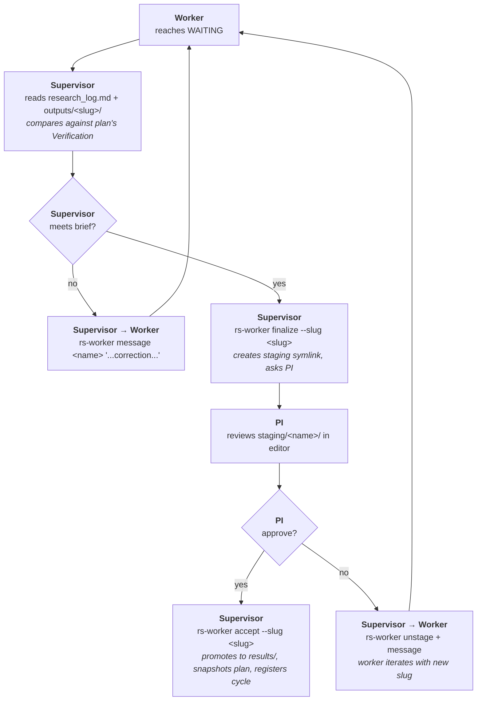

# Guide

Workflow walkthrough, debugging recipes, and FAQ. For threat model and isolation, see [SECURITY.md](SECURITY.md).

### Table of Contents

[◾ Anatomy of a research thread](#-anatomy-of-a-research-thread)
[◾ Supervisor and workers](#-supervisor-and-workers)
[◾ The four-section plan](#-the-four-section-plan)
[◾ Slugs, finalize, accept](#-slugs-finalize-accept)
[◾ The two-stream logbook](#-the-two-stream-logbook)
[◾ Authoring an MCP server](#-authoring-an-mcp-server)
[◾ Debugging](#-debugging)
[◾ Egress modes](#-egress-modes)
[◾ Multiple projects](#-multiple-projects)
[◾ Image rebuild rules](#-image-rebuild-rules)
[◾ FAQ](#-faq)

---

## ◾ Anatomy of a research thread

A typical thread looks like this:

1. **PI session start.** PI attaches to the supervisor (VSCode Remote-SSH or `project attach`). Claude Code starts. The supervisor reads its most-recent `logbook/supervisor/*.md` to reload context, lists `.workers/*.json` to see what exists.
2. **Question.** PI poses a research question in plain English.
3. **Reuse-or-fresh decision.** The supervisor inspects existing `down` workers' `summary.md` top line (their thematic identity). Same theme → respawn; new theme → new worker name.
4. **Plan.** Supervisor drafts `plan/draft/<name>.md` with `## Question / ## Inputs / ## Deliverables / ## Verification`. PI reviews; explicit "go" required.
5. **Spawn.** Supervisor runs `rs-worker spawn <name> --plan plan/draft/<name>.md [--mcps a,b]`. The harness validates the four sections, promotes the draft to canonical (`plan/<name>.md`), copies it as the worker's `task.md`, deletes the draft, starts a headless worker container.
6. **Block.** Supervisor calls `rs-worker wait <name>` and does *not* return to the PI until the worker terminates.
7. **Review.** Worker is in state `waiting` (idle) or `done` (clean exit). Supervisor reads `research_log.md`, opens `outputs/<slug>/`, compares against the plan's `## Verification`. Decides:
   - **Meets brief** → `rs-worker finalize <name> --slug <slug>`. Shows `staging/<name>/` to PI. On PI approval: `rs-worker accept`. The cycle is now in `results/<name>/<NNN>_<slug>/`.
   - **Minor gap** → `rs-worker message <name> "<correction>"` (queues follow-up in inbox; same container).
   - **Wrong shape** → fail loudly; iterate via message with a new slug.
8. **Loop until satisfied** for the current PI question, or escalate back if blocked on a decision only the PI can make.
9. **Session end.** PI types `/log`. Supervisor sends summarize-and-shutdown messages to every live worker, writes one `logbook/supervisor/<date>-<HHMM>.md` (chronological) and N `logbook/pi/<date>-<slug>.md` (executive, one per coherent topic). Then `rs-worker shutdown <name>` for each worker → registry state goes to `down`, container is gone, bind-mount preserved.

Next session, the PI reads the relevant `logbook/pi/*.md` to remember where things stood. The supervisor reads `logbook/supervisor/*.md` to remember its own decisions. Workers respawn from their `summary.md`.

## ◾ Supervisor and workers

The split is deliberate:

| | Supervisor | Worker |
|---|---|---|
| Lifetime | Per-project, long-lived (weeks/months) | Per-question; persistent across cycles, gone between sessions |
| Image | `rs-supervisor:latest` (miniconda + docker-ce + byobu + sshd) | `rs-analysis-base:latest` (miniconda + DS stack, no git, no sshd) |
| Auth | Per-project OAuth, once | Inherits the supervisor's creds at spawn time |
| Talks to | PI; rs-worker CLI; mcp-proxy (via spawned workers) | Its own task.md; MCPs via mcp-proxy (if granted) |
| Touches data | Reviews artifacts, never computes | Runs notebooks, queries, ML, etc. |
| Logbook | Writes `logbook/supervisor/*.md`, `logbook/pi/*.md` | Writes `summary.md`, `research_log.md` |

The supervisor *does not* run pandas. Writing briefs, reading deliverables, judging — yes; computing statistics — no. This keeps the supervisor's context window for orchestration, not for raw data.

Workers are *thematic*: one worker per coherent question, multiple cycles per worker. A statistics worker accepts cycles `001_basic-stats`, `002_per-language`, `003_outliers` over the project's life. Cycle ordinals (3-digit, accept-only) are stored in the registry; the rejected attempts stay on disk under `outputs/<slug>/` as provenance but don't get an ordinal.

Worker names are **project-permanent once used**. Destroying a worker tombstones the name. Pick `stats_v2` if you need to start over.

## ◾ The four-section plan

`rs-worker spawn` validates the plan structurally. Missing or malformed sections refuse the spawn:

```
## Question
What specifically is this worker answering this cycle?
(On respawn this is the new cycle's question — the worker also has summary.md
as prior-session memory.)

## Inputs
Explicit paths the worker needs (e.g. /workspace/shared/data/...).
Any assumptions about format, schema, size.

## Deliverables
What the worker must produce in /workspace/outputs/<slug>/:
  - notebook name(s)
  - data files (CSV, parquet, etc.)
  - figures
Plus what must appear in research_log.md's `## Cycle <slug>` section.
Explicitly name the slug you chose.

## Verification
How the supervisor will know the deliverable is correct. Concrete: expected
row counts, numeric ranges, shape of the output, sanity checks the worker
itself must run before returning to WAITING.
```

Plans live at two paths during their lifetime:
- **Draft** (`plan/draft/<name>.md`) — supervisor wrote it, awaiting PI approval. PI-visible, not yet authoritative.
- **Canonical** (`plan/<name>.md`) — harness-owned. Written *only* by `rs-worker spawn` from the draft. Editing it directly is the easiest way to break things.

`accept` snapshots `plan/<name>.md` into `results/<name>/<NNN>_<slug>/plan.md` — accepted cycle bundles preserve the plan that produced them, so respawning a worker with a new plan never loses the history of what produced past results.

## ◾ Slugs, finalize, accept

Each cycle has a **slug** — a kebab-case identifier naming the facet that cycle answered. Rules:

- Descriptive of the *facet*, not the topic. `stats-per-language`, not `basic-stats`.
- Unique within a worker — `accept` refuses a slug already in `.workers/<name>.json::cycles`.
- Don't repeat the worker name in the slug. `stats/per-language`, not `stats/stats-per-language`.

The cycle gating sequence has two gates — the supervisor's quality gate, then the PI's approval gate:



`accept` refuses on:
- worker not terminal (`done` or `waiting`)
- empty `outputs/<slug>/`
- `research_log.md` unchanged from skeleton (first cycle only)
- denied files present (`__pycache__`, `.ipynb_checkpoints`, `*.pyc`, `*.tmp`)
- slug already in the registry

`accept --waived "<reason>"` bypasses the shape gate; the reason is persisted in the cycle entry.

## ◾ The two-stream logbook

Two simultaneous logs at session end serve two readers:

```
logbook/supervisor/<YYYY-MM-DD>-<HHMM>.md      one per /log invocation
  - chronological, detailed
  - the supervisor's cold-resume memory
  - read by the supervisor next session
  - immutable after write

logbook/pi/<YYYY-MM-DD>-<slug>.md              one per coherent topic this session
  - executive, what the PI reads
  - cross-references the supervisor log via **Source:**
  - links downward to results/<name>/<NNN>_<slug>/ and outputs/<slug>/
  - immutable after write
```

The discipline: never edit a past logbook entry. Corrections become new entries in the next `/log`. This is what makes the log corpus trustworthy as the project's canonical memory.

How many PI topic logs per session?

| Situation | Topic logs |
|---|---|
| Related workers (one PI question decomposed) | 1, covering the synthesis |
| Independent workstreams | 1 per topic |
| Mix | Group by coherent topic; 1 per group |

## ◾ Authoring an MCP server

Three constraints define the contract between the research-sandbox and an MCP server:

1. **Streamable-HTTP transport.** Stdio MCPs are deferred. The Python SDK's `FastMCP("name").run(transport="streamable-http")` works out of the box; in any SDK, the server must speak JSON-RPC over POST.
2. **Endpoint at `/mcp`** (Python SDK default), or any path of your choosing — register with `--path <your-path>`.
3. **DNS-rebinding-protection allows `mcp-proxy:8888`.** The proxy pins this `Host` value on every upstream request, regardless of what the worker sent. Stable, can't be spoofed.

Minimal Python SDK example:

```python
from mcp.server.fastmcp import FastMCP

mcp = FastMCP("my-mcp")
mcp.settings.host = "0.0.0.0"
mcp.settings.port = 8000
mcp.settings.transport_security.allowed_hosts = ["mcp-proxy:8888"]

@mcp.tool()
def lookup(query: str) -> str:
    return f"result for {query}"

if __name__ == "__main__":
    mcp.run(transport="streamable-http")
```

Register and use:

```bash
docker build -t my-mcp:latest .
python research.py mcp add mymcp --kind shared --image my-mcp:latest --port 8000
python research.py project mcp-allow myproj mymcp
# inside supervisor, in your plan, ask the worker to use mymcp; spawn with --mcps mymcp
```

External (already-running) MCPs:

```bash
python research.py mcp add mymcp --kind external --host-port 9000
# host service must be reachable from host.docker.internal:9000
```

Auth headers (e.g. for hosted MCPs):

```bash
python research.py mcp add api --kind external --host-port 9000 \
    --header "Authorization=Bearer ${API_TOKEN}"
```

`${VAR}` is interpolated against the host environment when the registry is loaded; the resolved value is visible to the supervisor (and is treated as a per-project secret, no different from the supervisor's own OAuth token in scope). Don't put long-lived production tokens here.

## ◾ Debugging

### Worker mid-run

Inside the supervisor:

```bash
rs-worker tail <name> -f       # stream-json log live
rs-worker attach <name>        # byobu exec into the worker for poking around
rs-worker status <name>        # JSON: container + registry + log tail
```

The host can also browse `container_volumes/<proj>/workspace/workers/<name>/work/` directly — `outputs/`, `research_log.md`, `log.jsonl` are all plain files.

### Worker crashed

Container is `exited`, no `/workspace/DONE` sentinel. Look at the tail of `log.jsonl` — Claude Code's stream-json includes the assistant message that came right before the failure, and any error events. Re-spawn under a new name (`*_v2`) with an amended plan; the original name is now reserved.

### MCP not reachable

Three places to look, in order:

```bash
# (host) is the per-project router rule installed?
docker exec rs-router iptables -L FORWARD -n | grep <project-subnet>

# (supervisor) is the proxy config rendered correctly?
docker exec rs-project-<proj> cat /workspace/.orchestrator/mcp-proxy/config.json

# (supervisor) audit log — what does the proxy see?
docker exec rs-project-<proj> tail /workspace/.orchestrator/logs/mcp-proxy.jsonl
```

If the proxy isn't logging the request at all, the worker isn't reaching it (check `.mcp.json` URL, check inner firewall if enabled). If the proxy is logging requests with a non-2xx status, the upstream MCP is rejecting — most often DNS-rebinding-protection (allowlist `mcp-proxy:8888`) or wrong upstream path (use `--path`).

### Supervisor itself

```bash
python research.py project attach <proj>     # interactive byobu
docker logs rs-project-<proj>                # entrypoint output
docker exec rs-project-<proj> sudo cat /tmp/dockerd.log    # inner daemon log
```

## ◾ Egress modes

Set at `project create` time with `--egress`, default `open`:

| Mode | rs-router behavior |
|---|---|
| `open` | RFC1918 blocked (the host's own LAN); all other outbound allowed. Sensible default for research workloads that need pip, apt, package downloads. |
| `locked` | Only TCP/80, TCP/443, UDP/53, ICMP allowed; everything else dropped. Use when the project shouldn't egress to anything but HTTPS web traffic. |

Plus, independently, `--inner-firewall` adds a bridge-boundary ACL inside the supervisor's nested Docker daemon: workers can only egress rs-inner via mcp-proxy. Defense-in-depth — workers' direct internet access (subject to egress mode) is unaffected; the firewall affects how workers reach `mcp-proxy` vs other rs-inner destinations.

Change egress after creation: destroy + recreate.

## ◾ Multiple projects

Projects are fully independent. They share:
- Supervisor / worker / proxy *images* (built once per `research.py start`)
- The router (`rs-router`) and `rs-sandbox` network
- Shared MCPs you've registered

They don't share:
- Networks (each project has its own `rs-net-<proj>`)
- Workspaces (each in `<PROJECTS_DIR>/<proj>/`)
- Credentials (each does its own OAuth)
- MCP allowance (`project mcp-allow` is per-project)

You can run as many concurrent projects as your host can handle. SSH ports are auto-assigned.

## ◾ Image rebuild rules

Edits to `research.py` take effect immediately (it runs on the host with your Python).

Edits to anything in `cli/`, `container/`, or `agent/` require an image rebuild. After rebuilding, *existing* projects don't pick up the change — destroy + recreate is the canonical path.

| Edited path | Rebuild | Reach existing projects |
|---|---|---|
| `cli/rs_worker.py` | supervisor | destroy + create |
| `container/supervisor/*` | supervisor | destroy + create |
| `container/analysis/*` | supervisor (stages worker template) | destroy + create |
| `agent/Dockerfile.supervisor` | supervisor | destroy + create |
| `agent/Dockerfile.analysis-base` | analysis-base | re-`project create` (worker image is staged into inner daemon at create time) |
| `agent/Dockerfile.mcp-proxy` | mcp-proxy | destroy + create |
| `agent/entrypoint.supervisor.sh` | supervisor | destroy + create |
| `agent/entrypoint.worker.sh` | analysis-base | re-`project create` |

Rebuild command is the same in all cases:

```bash
python research.py start --rebuild
```

## ◾ FAQ

<details>
<summary><strong>Why one supervisor session and not parallel Claude windows?</strong></summary>

Two reasons. (1) Organizational separation: each worker gets only the context relevant to its question. The supervisor holds the bigger picture. Trying to do this in parallel windows means each window grows the same omnibus context. (2) The supervision harness — plan-before-spawn, finalize-before-accept, structural file checks — only enforces against one canonical orchestrator. Multiple parallel windows would race the registry and the canonical plan files.

</details>

<details>
<summary><strong>Can workers themselves spawn workers?</strong></summary>

No. Worker containers don't have docker-in-docker; the inner daemon belongs to the supervisor. By design — the planning gate is the supervisor's responsibility, and recursive spawning would defeat the bookkeeping.

</details>

<details>
<summary><strong>Can the PI talk directly to a worker?</strong></summary>

Yes, as an escape hatch — `rs-worker attach <name>` drops into byobu inside the worker's container. The default is "ask the supervisor"; the harness assumes the supervisor mediates, so direct intervention may surprise the supervisor's next read of the registry.

</details>

<details>
<summary><strong>What happens if I `/clear` mid-session?</strong></summary>

Generally safe — the supervisor reads its own logbook + the registry on the next message, so context rebuilds. But the *current* session's intent (e.g. "we agreed to spawn worker X but haven't yet") is in the conversation, not on disk. Type `/log` first if you've made decisions you don't want to lose.

</details>

<details>
<summary><strong>Where does the supervisor's prompt come from?</strong></summary>

`container/supervisor/CLAUDE.md` is baked into the supervisor image and copied to `/workspace/.claude/CLAUDE.md` on first boot. Editing the workspace copy applies to that one project; editing the source and rebuilding applies to new projects.

</details>

<details>
<summary><strong>How do I add a new worker type?</strong></summary>

Stage 3+ work. Today, all workers use `rs-analysis-base:latest`. The hooks for new types exist (`rs-worker spawn --image`, `--data-mount`, the `research.worker_type` label) but no canonical alternative images ship yet.

</details>

<details>
<summary><strong>Can I use this on macOS / Windows?</strong></summary>

Untested. The host CLI is stdlib Python so it'll run; the question is whether sysbox is available (Linux only) and whether DIND-under-`--privileged` works on your Docker Desktop. Linux is the supported path.

</details>

<details>
<summary><strong>How do I share results with collaborators?</strong></summary>

`results/<name>/<NNN>_<slug>/` is plain files in `<PROJECTS_DIR>/<proj>/workspace/results/`. Copy them, sync them, commit them — whatever your group does. Stage 4 will add a per-project Git layer; until then, manual.

</details>

<details>
<summary><strong>Can I run this without Sysbox?</strong></summary>

Yes — `--dind privileged` falls back to running the supervisor with `--privileged` and a named volume for the inner Docker daemon. Functional, but the supervisor's container boundary is weaker. Sysbox is strongly preferred where available.

</details>

<details>
<summary><strong>How do I migrate existing projects after editing supervisor code?</strong></summary>

Destroy + recreate. The supervisor image is staged at `project create` time; existing projects keep their snapshot. There is no live-migration path by design — the workspace is the durable artifact, the container is disposable.

</details>
